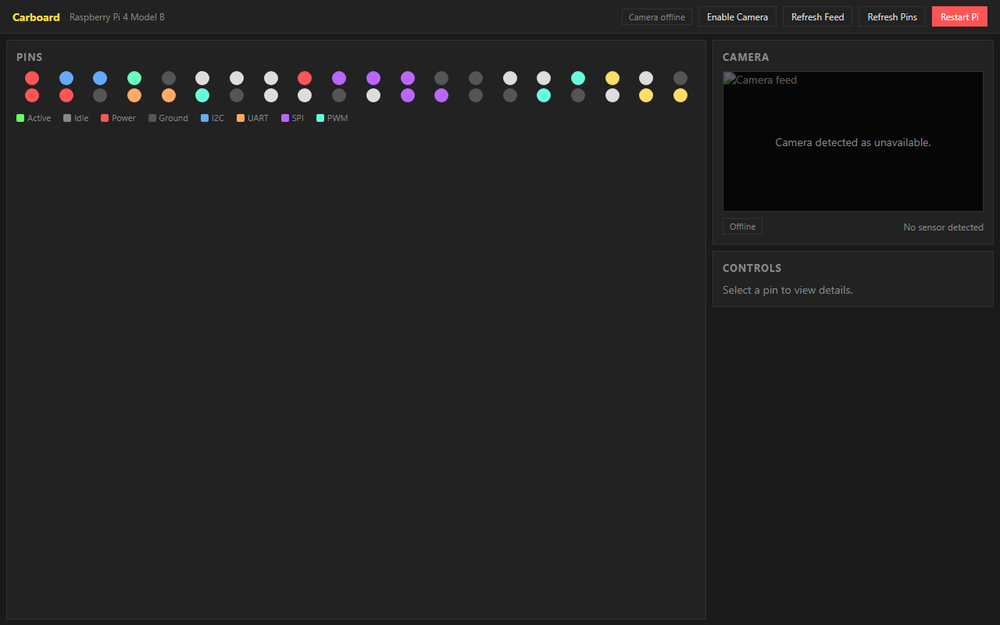

# Carboard

A small web console for a Raspberry Pi 4 that turns the 40-pin GPIO header and a
Camera Module 3 Wide into something you can drive from a browser. Built for a
self-hosted Pi that lives on the network, so you do not need to SSH in every time
you want to toggle a relay, drive a servo, or check what the camera sees.

## What it does

Carboard exposes a Flask app (port 8080) with a single page that renders the full
40-pin header as an interactive grid alongside a live camera feed. From the UI
you can:

- Click any controllable pin to turn it on or off and read back its current state.
- Switch PWM-capable pins (BCM 12, 13, 18, 19) to hardware PWM with a duty-cycle
  slider and a frequency field, useful for dimming LEDs or positioning servos.
- Stream the Camera Module 3 Wide as an MJPEG feed, toggle it on or off, and pop
  it into fullscreen.
- Restart the Pi from the page when a hard reset is needed.

The header layout, special-function pins (I2C, UART, SPI, PCM), reserved pins,
and power/ground rails are all labeled and color-coded, so it doubles as a
pinout reference. The hardware drivers are optional: when `gpiozero` and
`picamera2` are not present (for example on a dev laptop), the app still runs and
the API responds, which keeps local testing and CI practical.

## The problem it solves

Tinkering with a Pi usually means keeping an SSH session open and typing one-off
`gpiozero` snippets to flip a pin or start a recording. That gets tedious fast
and is awkward to share with someone who is not comfortable on the command line.
Carboard gives the same hardware a stable URL anyone on the LAN can open, with
guardrails (reserved-pin protection, PWM validation, graceful camera teardown)
that make random clicking safe.



## Tech stack

- Python 3 with Flask as the web framework
- `gpiozero` for digital and PWM output (`OutputDevice`, `PWMOutputDevice`)
- `picamera2` with the MJPEG encoder for the live stream
- Vanilla HTML/CSS/JS front end (no build step, no framework)
- systemd unit for always-on service management
- GitHub Actions deploying to a self-hosted ARM64 runner that lives on the Pi

## How to run

Local development (no Pi required):

```bash
uv venv
uv pip install flask gpiozero picamera2   # gpiozero / picamera2 are optional for dev
uv run main.py                             # or: py main.py
```

Then open http://localhost:8080. Without hardware libraries the UI still renders
and the JSON API works, it just does not touch real pins.

On the Pi itself, Carboard is meant to run as a systemd service. The included
`scripts/install_webapp.sh` copies `deploy/carboard-web.service` into
`/etc/systemd/system/`, enables it, and restarts it, so the app comes back on
boot. The `Deploy on Push` workflow automates this: every push to `main` runs on
the self-hosted `carboard` runner, pulls the latest code on the Pi, and re-runs
the install script.

## API

- `GET /` - the dashboard
- `GET /api/pins` - all pins with current state and PWM info
- `POST /api/pins/<bcm>` with `{"value": true|false}` - set a digital pin
- `POST /api/pins/<bcm>/pwm` with `{"frequency": hz, "duty_cycle": pct}` - set PWM
- `GET /api/camera` and `POST /api/camera` with `{"enabled": bool}` - camera status and toggle
- `GET /stream.mjpg` - the MJPEG camera stream
- `POST /api/system/restart` - reboot the Pi

## Notes

- The Pi is a Raspberry Pi 4 Model B with a 40-pin header; the camera is a
  Camera Module 3 Wide. Pin definitions live in `src/carboard_web/pinout.py`.
- `ssh.info` and other local connection details are gitignored and must stay
  local. Never commit secrets to this repository.
- Tests live under `tests/` and run with `uv run -m pytest -q`. See `AGENTS.md`
  for the full contributor guide.

## License

Licensed under the [MIT License](LICENSE).
